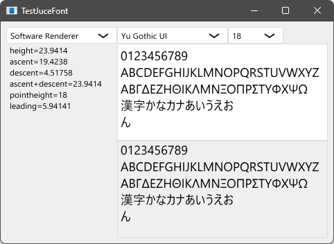

# TestJuceFont

Windows環境において、JUCEによるテキスト描画には多言語対応に関する問題がある。特に、フォントリンクがうまく機能しない。そのため、適切なシステムフォントを選択し、グリフ描画の結果を比較する簡単なコードを書いた。

In the Windows environment, text rendering with JUCE has problems related to multilingual support. In particular, the font linking does not work well. Therefore, I wrote a simple code to select an appropriate system font and compare the results of glyph drawing.

## Requirement

* JUCE framework 7.0.5: [download](https://juce.com/get-juce/download), [repository](https://github.com/juce-framework/JUCE)
* Projucer: [download](https://juce.com/discover/projucer), or build from source
* C++ build tools: Visual Studio, Xcode, etc.

## How to build

1. Open the .jucer file with the Projucer.
2. Correct the JUCE module path and properties, add exporters and save.
3. Build the generated C++ projects.

## Written by

[yu2924](https://twitter.com/yu2924)

## License

CC0 1.0 Universal
