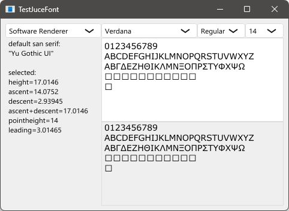

# TestJuceFont

Windows環境において、JUCEによるテキスト描画には多言語対応に関する問題がある。特に、フォントリンクがうまく機能しない。適切なグリフを持たないフォントを選ぶと四角い図形が表示されることがある。日本では、しばしばこれらは「豆腐」と呼ばれる。  
そこで実験のため、適切なシステムフォントを選択し、グリフ描画の結果を比較する簡単なコードを書いた。

In the Windows environment, text rendering with JUCE has problems related to multilingual support. In particular, the font linking does not work well.　Choosing a font that does not have the appropriate glyphs may result in the display of square shapes. In Japan, these are often called "tofu".  
So for the sake of experimentation, I wrote a simple code to select an appropriate system font and compare the results of glyph drawing.

## Requirement

* JUCE framework 7.0.5: [download](https://juce.com/get-juce/download), [repository](https://github.com/juce-framework/JUCE)
* Projucer: [download](https://juce.com/discover/projucer), or build from source
* C++ build tools: Visual Studio, Xcode, etc.

## How to build

1. Open the .jucer file with the Projucer.
2. Correct the JUCE module path and properties, add exporters and save.
3. Build the generated C++ projects.

## Written by

[yu2924](https://twitter.com/yu2924)

## License

CC0 1.0 Universal
